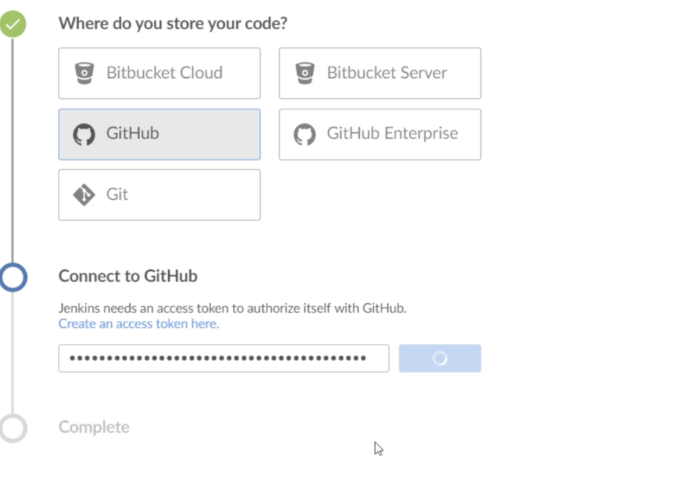
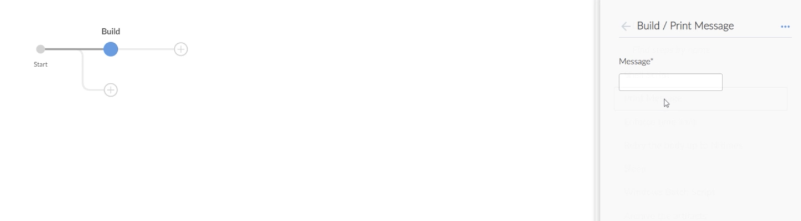
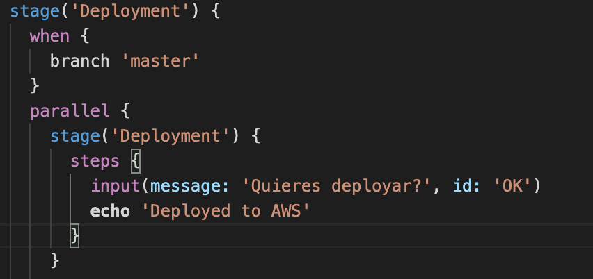
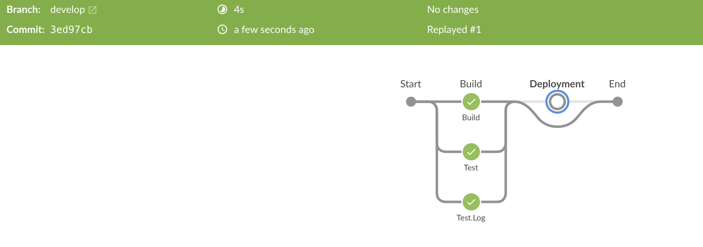
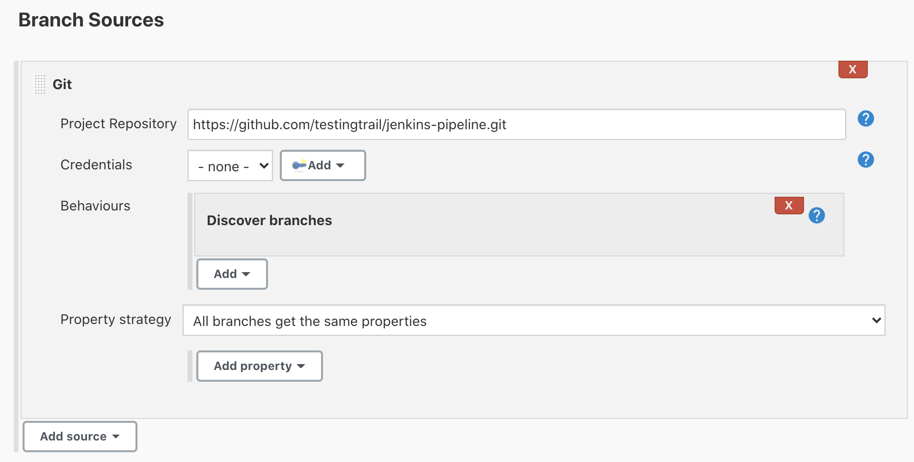

PIPELINE AS CODE WITH JENKINS
===================

Setting up!
-----------

1. First we are going to create a repo on github to save our project. Remember that the jenkinsfile will be in the root of your project's code. Clone that repo into your code folder and open visual code.

2. Install Jenkins (dekstop or in container) and go to manage plugins and install 'Blue Ocean'
    1. If using jenkins container make sure youhave docker installed and then run the command that is in Jenkins for docker here: https://github.com/jenkinsci/docker/blob/master/README.md

3. Activate Blue Ocean for left menu and create new pipeline, choose Github as repository for code

4. Go to Settings -> developer settings on Github and create an access token and paste it in Jenkins when ask for it. then choose the repository.

5. Create some dummy stages with steps of type 'print message', this is the pipeline editor, it allows to do the same as you can do directly on a Jenkinsfile. Save the pipeline, you can choose when you save if commit to master or to another branch, it will create a pipeline file in the github repository. 

6. Run the Pipeline. Go to github you will see the Jenkinsfile automatically created!!

Declarative pipeline
--------------------

This is a recent add to Jenkins where there is a more simplified and optimize sintax on top of the Pipeline. It is written inside a Jenkins file. 

you can see more in the Jenkins page [here](https://www.jenkins.io/doc/book/pipeline/syntax/#:~:text=The%20basic%20statements%20and%20expressions,be%20on%20its%20own%20line.)

 Creating files and archiving them
---------------------------------

You can create a log file for instance and save it within your pipeline.

1. Go to any step, let's say test and create a new stage with any any of type 'write file to the workspace'

2. choose any name and also some text. 

3. Then create a new stage called 'Artifacts' of type 'archiveartifacts' and put the name of the file you created above. 

4. Then when you build, in the 'Artifacts' tab you will be able to see your file in there.

5. Also you can create something like this to send variables locals and globals

writeFile(file: 'LogFile.txt', text: "This is a log file. The driver path is ${chromeDriverPath} and local variable is ${localvariable}")

 Creating conditionals
---------------------------------
You can create conditionals in your code so you can decide whether to run something or not.

1. Create a branch 'develop' and in the jenkinsfile add this before the stage to run

2. After commit and push, go to the pipeline in Jenkins and try to run it from the develop branch. You will see that step is skipped from develop branch as it was meant to do that in the jenkinsfile

 Validate Jenkins file plugin
---------------------------------

1. Download 'Jenkins pipeline linter connector' to validate 

2. You have to go to the documentation of the plugin so we may see how to configure your Jenkins, all steps are in there

3. Then just hit Shift + Command + P (MAC) to show the command palette and look for 'jenkins validate'

 Multibranch pipeline
---------------------------------

The multibranch pipeline type project enables you to implement different Jenkinfiles for different branches of the same project. this eliminates the need for manual pipeline creation and management. 

1. Go to Jenkins -> new multi branch pipeline -> put any name

2. select a display name

3. In branch source choose any github repo with two branches minimun, like this very same repo and choose 'Git', not 'Github' in the branch source. 

4. Now, if you save you will see it will start running for both of your pipelines. 